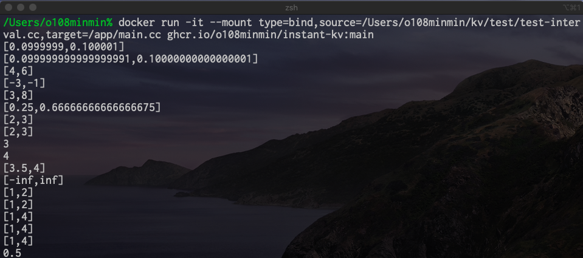

# instant-kv

<!-- # Short Description -->

docker image for [kv](https://github.com/mskashi/kv) library based on Ubuntu.

<!-- # Badges -->

[](https://github.com/o108minmin/instant-kv/issues)
[](https://github.com/o108minmin/instant-kv/network/members)
[](https://github.com/o108minmin/instant-kv/stargazers)
[](https://github.com/o108minmin/instant-kv/)
[](https://github.com/o108minmin/instant-kv/)

# Tags

`C++` `kv`

# Demo



# Advantages

cf. [official site instatllation](http://verifiedby.me/kv/)

- docker ready.
- Easy to start.
- Easy to update.

# Installation

```shell
docker pull ghcr.io/o108minmin/instant-kv:main
```

# Minimal Example

The example of [3. ダウンロードとインストール](http://verifiedby.me/kv/).

```shell
git clone https://github.com/mskashi/kv.git
docker pull ghcr.io/o108minmin/instant-kv:main
docker run -it --mount type=bind,source={path to kv/test}/test-interval.cc,target=/app/main.cc ghcr.io/o108minmin/instant-kv:main
```

# Contributors

- [o108minmin](https://github.com/o108minmin)

<!-- CREATED_BY_LEADYOU_README_GENERATOR -->
